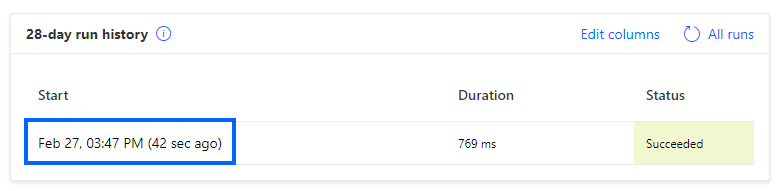
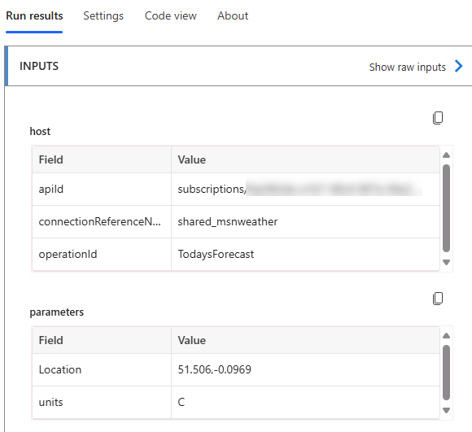
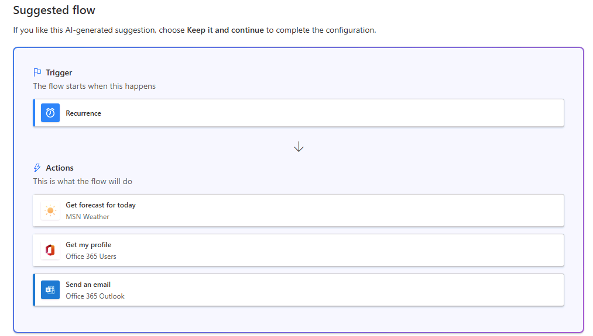
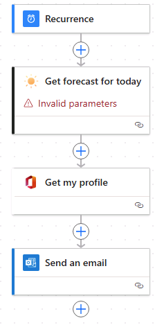
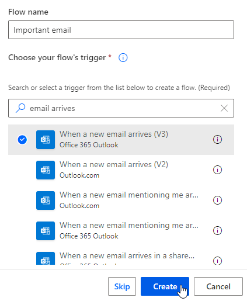
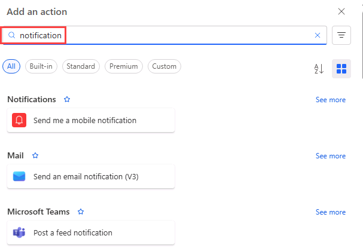
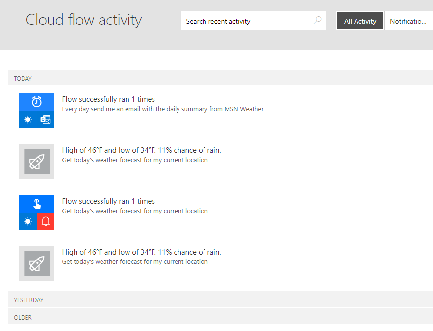

---
lab:
  title: 'ラボ 1:クラウド フローを作成する'
  module: 'Module 1: Get started with Power Automate'
---

# 実習ラボ 1 – クラウド フローを作成する

このラボでは、クラウド フローを作成します。

## 学習する内容

- CoPilot を使用してテンプレートから Power Automate クラウド フローを作成する方法
- Power Automate クラウド フローを最初から作成し、アクションを追加する方法

## ラボ手順の概要

- テンプレートからクラウド フローを作成する
- CoPilot を使用してクラウド フローを作成する
- クラウド フローの作成
- クラウド フロー アクティビティを監視する
  
## 前提条件

- 以下を完了している必要があります: 「**ラボ 0: ラボ環境を検証する**」

## 詳細な手順

## 演習 1 - テンプレートからクラウド フローを作成する

### タスク 1.1 - テンプレートを選択する

1. Power Automate ポータル `https://make.powerautomate.com` に移動する

1. **[Power Automate へようこそ]** ポップアップ ダイアログが表示されたら、**[作業の開始]** を選びます。

1. **[Dev One]** 環境を選びます。

    

1. 左側のメニューから **[テンプレート]** タブを選びます。

1. **[ボタン]** タブを選びます。

1. **[検索テンプレート]** フィールドに「`location`」を入力します。

    

1. **[現在の場所の今日の天気予報を取得する]** を選びます。

    ![[接続の作成] のスクリーンショット。](../media/create-connections.png)

1. **[MSN 天気]** で **[作成]** を選びます。

1. **[通知]** で **[作成]** を選びます。

1. **フローの作成**を選択します。

1. **[Your flow is ready to go] (フローの準備ができました)** ポップアップ ダイアログが表示されたら、**[今後このメッセージを表示しない]** を選び、**[了解]** を選びます。

    

### タスク 1.2 - フローを実行する

1. **[実行]** を選択します。

1. ダイアログが表示されたら、**[Know your location]\(場所を把握する\)** で **[許可する]** を選びます

1. **続行**を選択します。

1. **フローの実行**を選択します。

1. **完了**を選択します。

    

### タスク 1.3 - フローを確認する

1. フロー実行履歴で日付と時刻を選びます。

    

1. 緑色のチェック マークで **[今日の予報を取得する]** ステップを選びます。

    

1. **編集**を選択します。

1. **[プッシュ通知を送信する]** ステップのいずれかを選びます。

1. **[フロー チェッカー]** を選びます。 エラーや警告は表示されないはずです。

1. **[フロー チェッカー]** ウィンドウを閉じます。

### タスク 1.4 - フローをテストする

1. **[テスト]**、**[自動]**、**[With a recently used trigger]\(最近使用したトリガーを使用する\)** の順に選んでから、フローの実行を選びます。

    

1. **[Test]** を選択します。

1. コマンド バーの左上にある **<-** [戻る] ボタンを選びます。

## 演習 2 – CoPilot を使用してクラウド フローを作成する

### タスク 2.1 - プロンプトを入力する

1. Power Automate ポータル `https://make.powerautomate.com` に移動する 

1. **Dev One** 環境にいることを確認します。

1. 左側のメニューから **[ホーム]** タブを選びます。

1. **[Copilot を使用して自動化を作成する]** の下に `Every day send me an email with the daily summary from MSN Weather` を入力します。

    

1. **生成**を選択します。

    

1. [**次へ**] を選択します。

1. **フローの作成** を選択します。

    

### タスク 2.2 - フロー ステップを構成する

1. **[今日の予報を取得する]** ステップを選びます。

1. **[場所]** に「`Seattle`」と入力します。

1. **[X]** を選んで **[単位]** をクリアし、ドロップダウンで **[Imperial]\(英単位\)** を選びます

    

1. **[保存]** を選択します。

1. フローをテストするには、**[テスト]** を選択し、**[手動]** を選択してから、**[テスト]** を選択します。 

1. **[フローの実行]** を選択してから、**[完了]** を選択します。

1. コマンド バーの左上にある **<-** [戻る] ボタンを選びます。

## 演習 3 - 最初からクラウド フローを作成する

### タスク 3.1 - トリガーを作成する

1. Power Automate ポータル `https://make.powerautomate.com` に移動する

1. **Dev One** 環境内にいることを確認します。

1. 左側のメニューから **[+ 作成]** タブを選びます。

1. **[自動クラウド フロー]** を選びます。

1. **[フロー名]** に「`Important email`」と入力します。

1. **[すべてのトリガーを検索する]** フィールドに「`email arrives`]と入力します。

1. **[新しいメールが届いたとき (V3)]** を選びます。

    

1. **［作成］** を選択します

### タスク 3.2 - トリガーを構成する

1. **[新しいメールが届いたとき (V3)]** ステップを選びます。

1. **[すべて表示]** を選びます。

    

1. **[添付ファイルを含める]** で **[いいえ]** を選びます。

1. **[重要度]** で **[高]** を選びます。

1. **[フォルダー]** で **[受信トレイ]** を選びます。

### タスク 3.3 - アクションを追加する

1. トリガー ステップの下にある **+** アイコンを選び、**[アクションの追加]** を選びます。

1. メッセージが表示されたら、**[クリップボードにコピーされたテキストと画像を表示]** の **[許可]** を選択します。

1. 検索で「`notification`」と入力します。

    

1. **[Microsoft Teams]** で **[Post a feed notification]\(フィード通知を投稿する\)** を選びます。

1. **[サインイン]** を選択します。

1. テナントの資格情報を使用します。

1. **[Notification Type]\(通知の種類\)** で **[チーム]** を選びます。

1. **[受信者]** にテナント ユーザー ID を入力します。

1. **[通知text]** フィールドに「`/`」と入力し、**[動的コンテンツを追加する]** を選択します。

    

1. **[件名]** を選びます。

1. **[チーム]** に **[Contoso]** を選びます。

1. **[チャネル]** で **[全般]** を選びます。

1. **[保存]** を選択します。

1. コマンド バーの左上にある **<-** [戻る] ボタンを選びます。

## 演習 4 – フローを監視する

### タスク 4.1 - クラウド フロー アクティビティ

1. Power Automate ポータル `https://make.powerautomate.com` に移動する

1. **Dev One** 環境にいることを確認します。

1. **[...] > [その他]** を左側のメニューから選びます。

    

1. **[すべて検出]** を選択し、[監視]セクションで**クラウド フロー アクティビティ**を検索します。

1. **[Cloud flow activity]\(クラウド フロー アクティビティ\)** のピン アイコンを選びます。

1. 左側のメニューから **[Cloud flow activity]\(クラウド フロー アクティビティ\)** タブを選びます。

    

