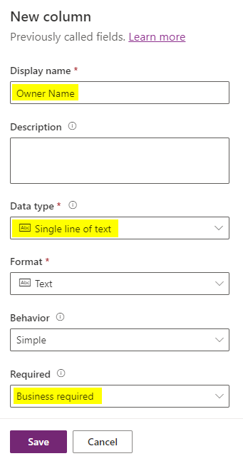

---
lab:
  title: 'ラボ 2:データ モデル'
  module: 'Module 2: Get started with Microsoft Dataverse'
---

# 実習ラボ 2 - データ モデル

このラボでは、Dataverse のテーブルと列を作成します。

## 学習する内容

- Microsoft Dataverse でテーブルと列を作成する方法
- 検索列を使ってリレーションシップを作成する方法

## ラボ手順の概要

- カスタム テーブルを作成する
- テーブルに列を追加する
- 検索列を使ってリレーションシップを作成する
  
## 前提条件

- 以下を完了している必要があります: 「**ラボ 0: ラボ環境を検証する**」

## 詳細な手順

## 演習 1 - カスタム テーブルを作成する

### タスク 1.1 - Opportunity テーブルを作成する

1. Power Apps Maker ポータル <https://make.powerapps.com> に移動します。

1. **Dev One** 環境にいることを確認します。

1. 左側のナビゲーション ウィンドウで、**テーブル**を選択します。

1. **[+ 新しいテーブル]** を選び、**[列とデータの追加]** を選びます。

    

1. [新しいテーブル] の横にある**鉛筆**アイコンを選びます

    

1. **[表示名]** に `Opportunity` を入力します。

1. **[保存]** を選択します。

### タスク 1.2 - プライマリ列

1. **[新しい列]** の横にあるドロップダウン キャレットを選び、**[列の編集]** を選びます。

    

1. **[表示名]** に `Opportunity Subject` を入力します。

1. **[更新]** を選択します。

1. **［作成］** を選択します

### タスク 1.3 - 列を追加する

1. **[Opportunity の列とデータ]** ペインで、**+** を選んで新しい列を追加します。

    

1. **[新しい列]** ペインで、次の値を入力するか選びます。

   1. 表示名: `Owner Name`
   1. データ型:**1 行のテキスト**
   1. 必須:**Business required**

    

1. **[保存]** を選択します。

1. **[Opportunity の列とデータ]** ペインで、**+** を選んで新しい列を追加します。

1. **[新しい列]** ペインで、次の値を入力するか選びます。

   1. 表示名: `Customer`
   1. データ型:**1 行のテキスト**
   1. 必須:**Business required**

1. **[保存]** を選択します。

1. **[新しい列]** ペインで、次の値を入力するか選びます。

   1. 表示名: `Address`
   1. データ型:**1 行のテキスト**
   1. 必須:**省略可能**

1. **[詳細オプション]** を展開し、**[最大文字数]** に「`200`」と入力します。

1. **[保存]** を選択します。

1. **[Opportunity の列とデータ]** ペインで **+** を選び、**[新しい列]** ペインに次の値を入力するか選びます。

   1. 表示名: `Estimated Close Date`
   1. データ型:**日付と時刻**
   1. 形式:**日付のみ**
   1. 必須:**省略可能**

1. **[保存]** を選択します。

1. **[Opportunity の列とデータ]** ペインで **+** を選び、**[新しい列]** ペインに次の値を入力するか選びます。

   1. 表示名: `Amount`
   1. データ型:"**通貨**"
   1. 必須:**省略可能**

1. **[保存]** を選択します。

1. **[Opportunity の列とデータ]** ペインで **+** を選び、**[新しい列]** ペインに次の値を入力するか選びます。

   1. 表示名: `Notes`
   1. データ型:**複数行のテキスト**
   1. 形式:**Text**
   1. 必須:**省略可能**

### タスク 1.4 - 選択肢列を追加する

1. **[Opportunity の列とデータ]** ペインで **+** を選び、**[新しい列]** ペインに次の値を入力するか選びます。

   1. 表示名: `Status`
   1. データ型:**選択肢**
   1. 必須:**省略可能**

1. **[グローバルな選択肢と同期?]** で **[いいえ]** を選びます

1. **[ラベル]** に「`New`」と入力し、**[値]** に「`1`」と入力します。

1. **[+ 新しい選択肢]** を選び、**[ラベル]** に「`Open`」と入力し、**[値]** に「`2`」と入力します。

1. **[+ 新しい選択肢]** を選び、**[ラベル]** に「`Closed`」と入力し、**[値]** に「`3`」と入力します。

1. **[既定の選択肢]** に **[新規]** を選びます。

    

1. **[保存]** を選択します。

## 演習 2 - リレーションシップを作成する

### タスク 2.1 - 検索列を作成する

1. Power Apps Maker ポータル <https://make.powerapps.com> に移動します。

1. **Dev One** 環境にいることを確認します。

1. 左側のナビゲーション ウィンドウで、**テーブル**を選択します。

1. **営業案件**を選択します。

1. **[Opportunity の列とデータ]** ペインで **+** を選び、**[新しい列]** ペインに次の値を入力するか選びます。

   1. 表示名: `Account`
   1. データ型:**Lookup**
   1. 必須:**省略可能**
   1. 関連テーブル:**アカウント**

    

1. **[保存]** を選択します。

## 演習 3 - データ

### タスク 3.1 - 営業案件レコードを追加する

1. Power Apps Maker ポータル <https://make.powerapps.com> に移動します。

1. **Dev One** 環境にいることを確認します。

1. 左側のナビゲーション ウィンドウで、**テーブル**を選択します。

1. **営業案件**を選択します。

1. **[Opportunity の列とデータ]** ペインで、**[編集]** の横にあるドロップダウン キャレットを選び、**[新しいタブで編集]** を選びます。

1. 以下の値を入力または選択します。

   1. Opportunity Subject: `100 Widgets`
   1. Owner Name: `MOD Administrator`
   1. Customer: `Adventure Works`
   1. Estimated Close Date:**前月の日付を選択する**
   1. 状態:**終了**
   1. Amount: `10,000`

1. **[下に行を挿入する]** を選び、次の値を入力するか選びます。

   1. Opportunity Subject: `Key customer`
   1. Owner Name: `MOD Administrator`
   1. Customer: `Fabrikam`
   1. Estimated Close Date:**現在の月の将来の日付を選択する**
   1. 状態:**[新規作成]**
   1. Amount: `50,000`

1. **[下に行を挿入する]** を選び、次の値を入力するか選びます。

   1. Opportunity Subject: `New customer`
   1. Owner Name: `MOD Administrator`
   1. Customer: `Coho Winery`
   1. Estimated Close Date:**次の月の将来の日付を選択する**
   1. 状態:**[新規作成]**
   1. Amount: `25,000`

1. **[下に行を挿入する]** を選び、次の値を入力するか選びます。

   1. Opportunity Subject: `Repeat customer`
   1. Owner Name: `MOD Administrator`
   1. Customer: `Fourth Coffee`
   1. Estimated Close Date:**次の月の将来の日付を選択する**
   1. 状態:**[ファイル]**
   1. Amount: `15,000`

    ![[データの編集] ペインのスクリーンショット。](../media/edit-data.png)

1. [データの編集] タブを閉じます。
