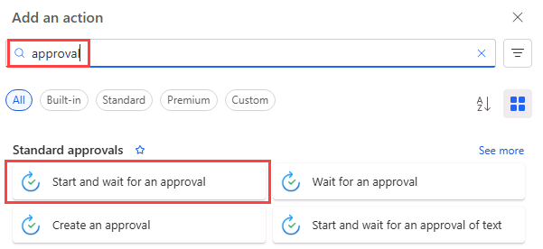
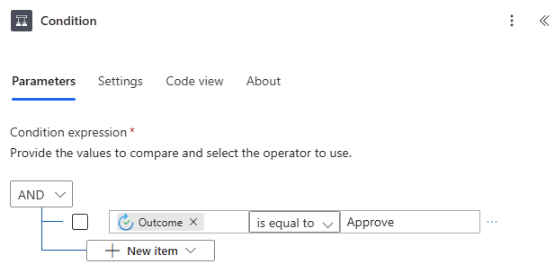

---
lab:
  title: 'ラボ 4:承認フロー'
  module: 'Module 3: Build approval flows with Power Automate'
---

# 実習ラボ 4 - 承認フロー

このラボでは、承認フローを作成します。

## 学習する内容

- Power Automate 承認クラウド フローを作成する方法

## ラボ手順の概要

- SharePoint リストの自動クラウド フローを作成する
- 承認を作成
- 承認結果の条件を追加する
- フローをテストする
  
## 前提条件

- 以下を完了している必要があります: 「**ラボ 3: SharePoint**

## 詳細な手順

## 演習 1 - 承認フローを作成する

### タスク 1.1 - トリガーを作成する

1. Power Automate ポータル <https://make.powerautomate.com> に移動します。

1. **Dev One** 環境にいることを確認します。

1. 左側のメニューから **[+ 作成]** タブを選びます。

1. **[自動クラウド フロー]** を選びます。

1. **[フロー名]** に「`Task approval`」と入力します。

1. 検索で「`SharePoint`」と入力します。

1. **[項目が作成されたとき]** を選びます。

1. **［作成］** を選択します

### タスク 1.2 - トリガーを構成する

1. **[項目が作成されたとき]** ステップを選びます。

1. **[項目が作成されたとき]** ステップ名を選び、「`New task`」と入力します。

1. 前のラボで作成した **Power Automate SharePoint サイト**を選びます。 サイトが一覧にない場合は、**[カスタム値の入力]** を選択し、Power Autmate SharePoint サイトの URL を貼り付けます

1. **[タスク]** リストを選びます。

    

### タスク 1.3 - 承認アクションを追加する

1. トリガー ステップの下にある **+** アイコンを選び、**[アクションの追加]** を選びます。

1. 検索で「`approval`」と入力します。

    

1. **[承認]** で **[開始して承認を待つ]** を選びます。

1. **[新規作成]** を選択します。

1. **[承認の種類]** で **[承認/拒否 - 最初に応答]** を選びます

1. **[開始して承認を待つ]** ステップ名を選び、「`Approval`」と入力します。

1. **[Title]** フィールドを選び、[動的コンテンツ] アイコンを選びます。

    

1. **[Title]** を選びます。

1. **[割り当て先ユーザー/グループ]** にテナントのユーザー ID を入力します。

1. **[Details]** フィールドを選び、[動的コンテンツ] アイコンを選びます。

1. **[Description]** を選びます。

1. **[項目リンク]** フィールドを選び、[動的コンテンツ] アイコンを選び、**[表示数を増やす]** を選びます。

1. **[項目へのリンク]** を選びます。

### タスク 1.4 - 条件を追加する

1. 承認ステップの下にある **+** アイコンを選び、**[アクションの追加]** を選びます。

1. 検索で「`condition`」と入力します。

1. **[コントロール]** で **[条件]** を選びます。

1. 左側の **[値の選択]** フィールドを選び、[動的コンテンツ] アイコンを選びます。

    

1. **[成果]** を選びます。

1. **[演算子]** に **[次の値に等しい]** を選びます。

1. 右側の **[値の選択]** フィールドを選び、「`Approve`」と入力します。

    

### タスク 1.5 - 状態アクションを更新する

1. **[True]** の下にある **+** アイコンを選び、**[アクションの追加]** を選びます。

1. 検索で「`update item`」と入力します。

1. **[SharePoint]** の下にある **[項目の更新]** を選びます。

1. **[項目の更新]** ステップ名を選び、「`Set task to approved`」と入力します。

1. **Power Automate SharePoint サイト**を選びます。

1. **[タスク]** リストを選びます。

1. **[ID]** フィールドを選び、[動的なコンテンツ] アイコンを選びます。

1. **[新しいタスク]** から **[ID]** を選びます。

1. **[すべて表示]** を選びます。

1. **[Title]** フィールドを選び、[動的コンテンツ] アイコンを選びます。

1. **[新しいタスク]** から **[タイトル]** を選びます。

1. **[承認状態の値]** に **[承認済み]** を選びます。

1. **[False]** の下にある **+** アイコンを選び、**[アクションの追加]** を選びます。

1. 検索で「`update item`」と入力します。

1. **[SharePoint]** の下にある **[項目の更新]** を選びます。

1. **[項目 1 の更新]** ステップ名を選び、「`Set task to declined`」と入力します。

1. **Power Automate SharePoint サイト**を選びます。

1. **[タスク]** リストを選びます。

1. **[ID]** フィールドを選び、[動的なコンテンツ] アイコンを選びます。

1. **[新しいタスク]** から **[ID]** を選びます。

1. **[すべて表示]** を選びます。

1. **[Title]** フィールドを選び、[動的コンテンツ] アイコンを選びます。

1. **[新しいタスク]** から **[タイトル]** を選びます。

1. **[承認状態の値]** で **[拒否済み]** を選びます。

1. **[保存]** を選択します。

1. コマンド バーの左上にある **<-** [戻る] ボタンを選びます。

## 演習 2 - テストの承認

### タスク 2.1 - 承認フローをトリガーする

1. SharePoint サイトに移動し、**[タスク]** リストを選びます。

1. **[+ 新規]** を選び、次のデータを入力して、**[保存]** を選びます。

   1. Title = `Approval test`
   1. Description = `Test`
   1. Owner Name = `MOD Administrator`
   1. Deadline = **Today**
   1. Approval Status = **New**

### タスク 2.2 - 進行状況の承認

1. Power Automate ポータル <https://make.powerautomate.com> に移動します。

1. **Dev One** 環境にいることを確認します。

1. 左側のメニューから **[マイ フロー]** タブを選びます。

1. **[タスクの承認]** を選びます。

1. フロー実行履歴で日付と時刻を選びます。

    > **注:**  承認機能はバックグラウンドでインストールされます。 これにはおよそ 10 分かかります。

1. 左側のメニューから **[承認]** タブを選びます。

    

1. **[承認テスト]** を選び、**[ティック]** を選び、**[確認]** を選びます。

1. **完了** を選択します。

1. 左側のメニューから **[マイ フロー]** タブを選びます。

1. **[タスクの承認]** を選びます。

1. フロー実行履歴で日付と時刻を選びます。

1. SharePoint サイトに移動し、**[タスク]** リストを選びます。

1. **[承認テスト]** 項目の **[承認状態]** が **[承認済み]** であることを確認します。
