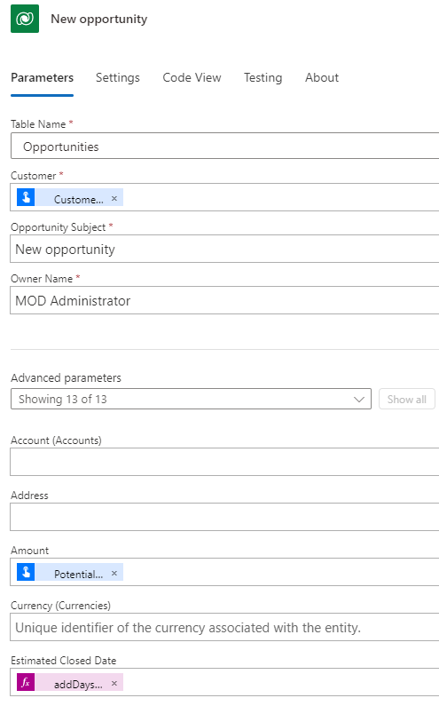

---
lab:
  title: 'ラボ 5:ボタン フロー'
  module: 'Module 4: Build flows to manage user information'
---

# 実習ラボ 5 - ボタン フロー

このラボでは、ボタン フローを作成します。

## 学習する内容

- Power Automate のインスタント ボタン フローを作成する方法

## ラボ手順の概要

- ボタン フローを作成する
- トリガー トークンを使用する
- ユーザー入力を追加する
- フローをテストする
  
## 前提条件

- 以下を完了している必要があります。「**ラボ 2: データ モデル**」

## 詳細な手順

## 演習 1 - ボタン フローを作成する

### タスク 1.1 - トリガーを作成する

1. Power Automate ポータル <https://make.powerautomate.com> に移動します。

1. **Dev One** 環境にいることを確認します。

1. 左側のメニューから **[+ 作成]** タブを選びます。

1. **インスタント クラウド フロー**を選択します。

1. **[フロー名]** に「`Create opportunity`」と入力します。

1. **[手動でフローをトリガーする]** を選びます。

1. **［作成］** を選択します

### タスク 1.2 - ユーザー入力を追加する

1. **[手動でフローをトリガーする]** ステップを選びます。

1. **[手動でフローをトリガーする]** ステップを選び、「`Button clicked`」を入力してください。

1. **入力の追加**を選択します。

1. **[テキスト]** を選びます

1. **[入力]** に「`Customer Name`」と入力します。

1. **[入力を指定してください]** に「`Please enter the customer name`」と入力します。

1. **入力の追加**を選択します。

1. **[テキスト]** を選びます

1. **[入力]** に「`Comments`」と入力します。

1. **[入力を指定してください]** に「`Any comments`」と入力します。

1. **入力の追加**を選択します。

1. **[番号]** を選びます

1. **[入力]** に「`Potential Sale`」と入力します。

    

### タスク 1.3 - 営業案件の作成アクションを追加する

1. トリガー ステップの下にある **+** アイコンを選び、**[アクションの追加]** を選びます。

1. 検索で「`add row`」と入力します。

1. **[Dataverse]** で **[新しい行の追加]** を選びます。

1. **[サインイン]** を選びます

1. テナントの資格情報を使います。

1. **[新しい行を追加する]** ステップ名を選択し、「`New opportunity`」と入力してください。

1. **[テーブル名]** に **[Opportunities]\(営業案件\)** を選びます

1. **[顧客]** フィールドを選択し、[動的コンテンツ] アイコンを選択して、**[表示数を増やす]** を選択してください。

1. **[Customer Name]** を選びます。

1. **[Opportunity Subject]** フィールドを選び、「`New opportunity`」と入力します。

1. **[Owner Name]** フィールドを選び、「`MOD Administrator`」と入力します。

1. **[すべて表示]** を選びます。

1. **[Amount]** フィールドを選び、[動的コンテンツ] アイコンを選びます。

1. **[Potential Sale]** を選びます。

1. **[項目リンク]** フィールドを選び、[動的コンテンツ] アイコンを選び、**[表示数を増やす]** を選択してください。

1. **[Comments]** を選びます。

1. **[Estimated Close Date]** フィールドを選び、式アイコンを選びます。

1. `addDays(utcNow(),30)` という式を入力し、**[追加]** を選びます。

    

1. **[保存]** を選択します。

## 演習 2 - テスト ボタン フロー

### タスク 2.1 - 実行ボタン フロー

1. **[テスト]** を選びます

1. **[手動]** を選びます。

1. **[Test]** を選択します。

    

1. 次の詳細を入力します。

   1. Customer Name = `Button test`
   1. Comments = `This is a test`
   1. Potential Sale = `9999`

1. **フローの実行**を選択します。

1. **完了**を選択します。

1. コマンド バーの左上にある **<-** [戻る] ボタンを選びます。

### タスク 2.2 - 作成された営業案件レコードを確認する

1. Power Apps Maker ポータル <https://make.powerapps.com> に移動します。

1. **Dev One** 環境にいることを確認します。

1. 左側のナビゲーション ウィンドウで、**テーブル**を選択します。

1. **営業案件**を選択します。
