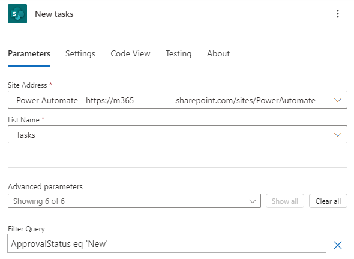
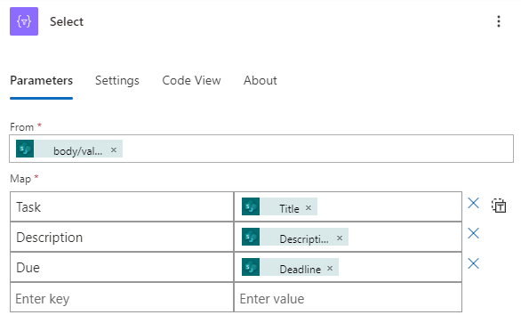

---
lab:
  title: 'ラボ 6: 予定フロー'
  module: 'Module 5: Power Automate’s deep integration across multiple data sources'
---

# 実習ラボ 6 – 予定フロー

このラボでは、予定フローを作成します。

## 学習する内容

- Power Automate の予定フローを作成し、SharePoint アイテムの一覧を処理する方法。

## ラボ手順の概要

- 予定フローを作成する
- SharePoint リストのクエリを実行する
- データ操作を使用する
- フローをテストする
  
## 前提条件

- 以下を完了している必要があります: 「**ラボ 3: SharePoint**

## 詳細な手順

## 演習 1 – 予定フローを作成する

### タスク 1.1 - トリガーを作成する

1. Power Automate ポータル `https://make.powerautomate.com` に移動する

1. **Dev One** 環境にいることを確認します。

1. 左側のナビゲーション メニューから **[+ 作成]** タブを選びます。

1. **[Scheduled cloud flow](スケジュールされたクラウド フロー)** を選択します。

1. **[フロー名]** に「`Daily New Tasks`」と入力します。

1. **1** **日****ごとに繰り返す**よう設定します。

    

1. **［作成］** を選択します

### タスク 1.2 - トリガーを構成する

1. **繰り返し**ステップを選択します。

1. **[繰り返し]** ステップ名を選んで、「`Daily`」と入力します。

### タスク 1.3 - 新しいタスクのクエリを実行する

1. トリガー ステップの下にある **+** アイコンを選び、**[アクションの追加]** を選びます。

1. 検索で「`list items`」と入力します。

1. **[SharePoint]** の **[複数の項目の取得]** を選択します。

1. **[複数の項目の取得]** ステップ名を選んで、「`New tasks`」と入力します。

1. **Power Automate SharePoint サイト**を選びます。

1. **[タスク]** リストを選びます。

1. **詳細パラメーター**で、[**すべて表示**] を選択します。

1. **[フィルター クエリ]** フィールドを選択し、「`ApprovalStatus eq 'New'`」と入力します

    

### タスク 1.4 - 列を選択する

1. **[新しいタスク]** ステップの下にある [**+**] アイコンを選択し、**[アクションの追加]** を選択します。

1. 検索で「`Select`」と入力します。

1. **[ランタイム]** で **[組み込み]** を選択します。

1. **[データ操作]** の **[選択]** を選択します。

1. **[開始]** フィールドを選択し、[動的なコンテンツ] アイコンを選択します。

1. **[新しいタスク]** から **[body/value] (本文/値)** を選びます。

1. **[キーの入力]** フィールドを選択し、「`Task`」と入力します。

1. **[値の入力]** フィールドを選択し、[動的なコンテンツ] アイコンを選択します。

1. **[新しいタスク]** から **[タイトル]** を選びます。

1. **[キーの入力]** フィールドを選択し、「`Description`」と入力します。

1. **[値の入力]** フィールドを選択し、[動的なコンテンツ] アイコンを選択します。

1. **[新しいタスク]** から **[説明]** を選択します。

1. **[キーの入力]** フィールドを選択し、「`Due`」と入力します。

1. **[値の入力]** フィールドを選び、[動的なコンテンツ] アイコンを選んで、**[詳細を表示]** を選びます。

1. **[新しいタスク]** から **[期限]** を選択します。

    

1. フロー デザイナーによって 1 つ以上の For Each ループが自動的に追加されている場合は、ループの外側にある Select ステップをドラッグして、ループを削除します。

    

### タスク 1.5 - テーブルを作成する

1. 選択ステップの下にある **[+]** アイコンを選択し、**[アクションの追加]** を選択します。

1. 検索で「`create html`」と入力します。

1. **[データ操作]** で **[HTML テーブルの作成]** を選択します。

1. **[HTML テーブルの作成]** ステップ名を選んで、「`Format as HTML table`」と入力します。

1. **[開始]** フィールドを選択し、[動的なコンテンツ] アイコンを選択します。

1. **[選択]** から **[出力]** を選択します。

    

### タスク 1.6 - メールを送信する

1. **HTML テーブルとして書式設定**ステップの下にある [**+**] アイコンを選択し、**[アクションの追加]** を選択します。

1. 検索で「`email`」と入力します。

1. **[Office 365 Outlook]** で **[メールの送信 (V2)** を選びます。

1. **[電子メールの送信 (V2)]** ステップ名を選択し、「`Notify by email`」と入力します。

1. **[宛先]** フィールドを選び、**[カスタム値の入力]** を選びます。

1. **[宛先]** にテナント ユーザー ID を入力します。

1. **[件名]** フィールドを選び、「`Daily Tasks`」と入力します。

1. **[本文]** フィールドを選び、[動的なコンテンツ] アイコンを選びます。

1. **[Format as HTML table]\(HTML テーブルとして書式設定\)** から **[出力]** を選択します。

1. **[保存]** を選択します。

## 演習 2 – 予定フローをテストする

### タスク 2.1 - 予定フローを手動で実行する

1. **[テスト]** を選びます

1. **[手動]** を選びます。

1. **[Test]** を選択します。

1. **フローの実行**を選択します。

1. **完了**を選択します。

1. Power Automate ポータルで、ブラウザー ウィンドウの左上にある**アプリ起動ツール**を選び、**[Outlook]** を選びます。

    

