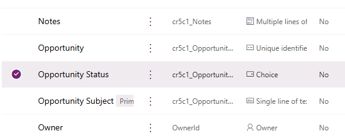
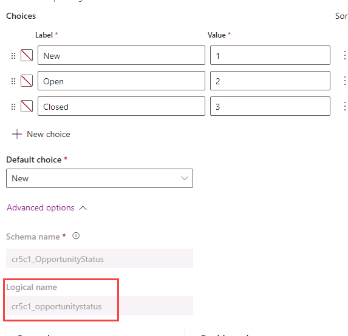

---
lab:
  title: 'ラボ 7: トリガー フィルター'
  module: 'Module 5: Power Automate’s deep integration across multiple data sources'
---

# 実習ラボ 7 – トリガー フィルター

このラボでは、更新トリガーをフィルター処理します。

## 学習する内容

- トリガーをフィルター処理する方法

## ラボ手順の概要

- 自動化フローを作成する
- 列フィルターを追加する
- クエリ フィルターを追加する

## 前提条件

- 以下を完了している必要があります。「**ラボ 2: データ モデル**」

## 詳細な手順

## 演習 1 - スキーマ名

### タスク 1.1 - 列スキーマ名

1. Power Apps 作成者ポータル (`https://make.powerapps.com`) に移動します

1. **Dev One** 環境にいることを確認します。

1. 左側のナビゲーション ウィンドウで、**テーブル**を選択します。

1. **営業案件**を選択します。

1. **スキーマ** の下で、**列** を選択します。

1. **[状態]** 列を選びます。

    

1. **詳細オプション**を展開します。

    

1. フローで使用する**論理名**をコピーします。

   > **注:** 状態列のプレフィックスが異なる場合があります。

## 演習 2 – 自動化フローを作成する

### タスク 2.1 - トリガーを作成する

1. Power Automate ポータル `https://make.powerautomate.com` に移動する

1. **Dev One** 環境にいることを確認します。

1. 左側のナビゲーション メニューから **[+ 作成]** タブを選びます。

1. **[自動クラウド フロー]** を選びます。

1. **[フロー名]** に「`Opportunity Closed`」と入力します。

1. [すべてのトリガーを検索する] に `Dataverse` と入力してください。

1. **When a row is added, modified or deleted]\(行が追加、変更、または削除された場合\)** を選びます。

1. **［作成］** を選択します

### タスク 2.2 - トリガーを構成する

1. **When a row is added, modified or deleted]\(行が追加、変更、または削除された場合\)** ステップを選びます。

1. **[行が追加、変更、または削除された場合]** ステップ名を選び、「`Opportunity changed`」と入力します。

1. **[変更の種類]** で **[変更済み]** を選びます。

1. **[テーブル名]** に **[Opportunities]\(営業案件\)** を選択します

1. **[範囲]** に **[組織]** を選択します

    

### タスク 2.3 - メールを送信する

1. トリガー ステップの下にある **+** アイコンを選び、**[アクションの追加]** を選びます。

1. 検索で「`email`」と入力します。

1. **[Office 365 Outlook]** で **[メールの送信 (V2)** を選びます。

1. **[電子メールの送信 (V2)]** ステップ名を選択し、「`Notify by email`」と入力します。

1. **[宛先]** フィールドを選び、**[カスタム値の入力]** を選びます。

1. **[宛先]** にテナント ユーザー ID を入力します。

1. **[件名]** フィールドを選び、「`Opportunity closed`」と入力します。

1. **[本文]** フィールドを選び、[動的なコンテンツ] アイコンを選びます。

1. **[Opportunity changed]\(変更された営業案件\)** から **[Opportunity Subject]\(営業案件の件名\)** を選びます。

1. **"本文"** フィールドを選択し、[動的コンテンツ] アイコンを選択してから、**[詳細]** を選択します。

1. **[Opportunity changed]\(変更された営業案件\)** から **[状態]** を選びます。

### タスク 2.4 - 列フィルター

1. **[変更された営業案件]** ステップを選択してください。

1. **[すべて表示]** を選びます

1. **[列の選択]** フィールドを選択し、前の演習の**論理名**を入力します。次に例を示します。`cr977_status`

   > **注:**  使用する状態列のプレフィックスは異なります。

### タスク 2.5 - 行フィルター

1. **[Opportunity changed]\(変更された営業案件\)** ステップを選びます。

1. **[すべて表示]** を選びます

1. **[フィルター行]** フィールドを選択し、前の演習の **論理名** を使用して「`cr977_status eq 3`」を入力します。

    

    > **注:**  使用する状態列のプレフィックスは異なります。

1. **[保存]** を選択します。

1. コマンド バーの左上にある **<-** **[戻る]** ボタンを選択します。

